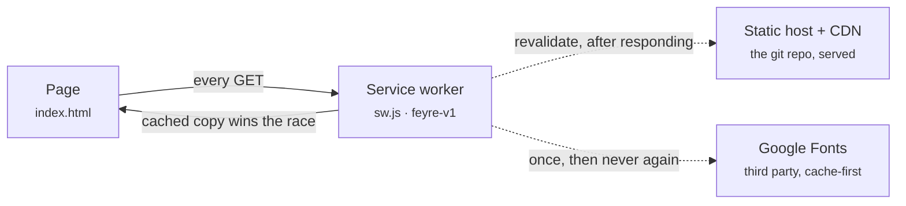
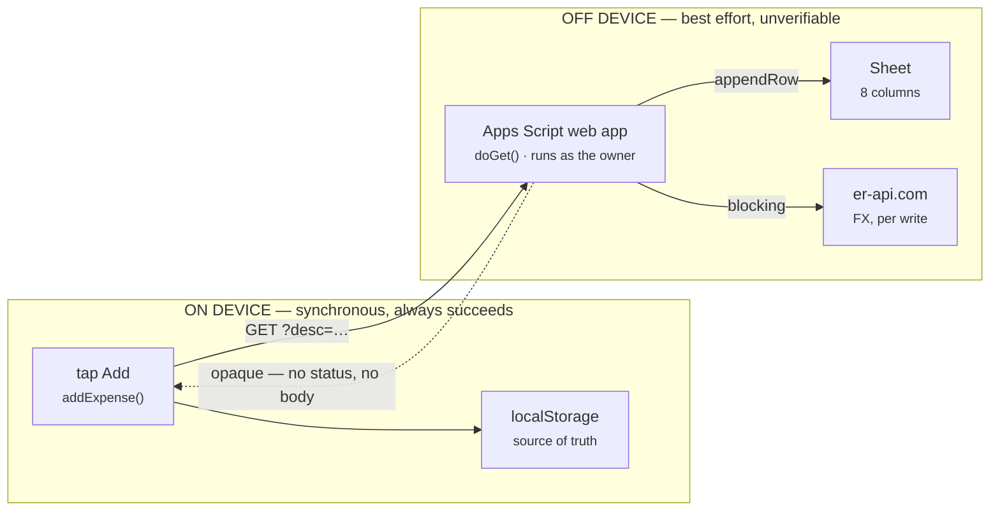
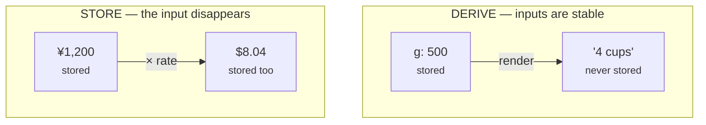
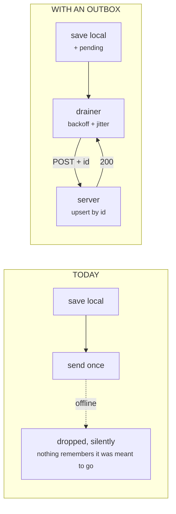
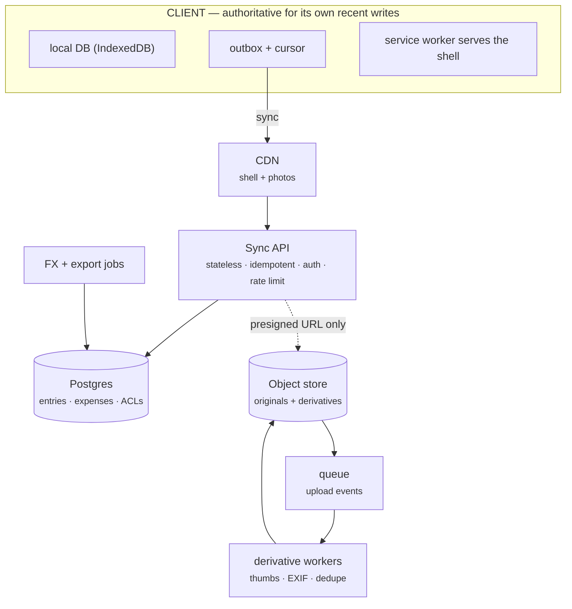
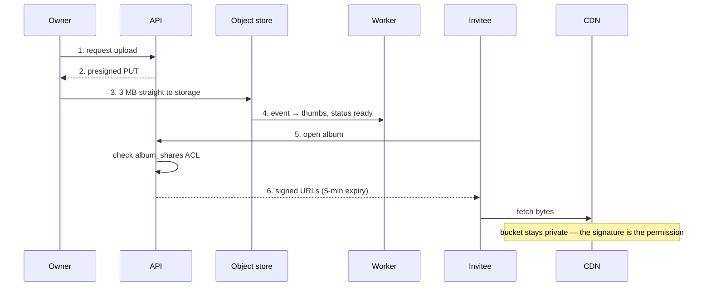

# Feyre Life Under Load

*A system design course built entirely out of this repo.*

A personal diary that installs to a home screen, works with no signal, and has no
build step is already a distributed system — it has a cache, a replica, an
eventually-consistent write path, and an unacknowledged RPC. This reads the repo
as the specimen: what it gets right, the ten places it breaks, what the numbers
say, and the interview that falls out of it.

| | |
|---|---|
| Dependencies | 0 |
| Lines of app code | ~1,755 |
| Precached shell | ~34 KB |
| Places data lives | 3 |
| Server functions | 1 |
| Acknowledged writes | 0 |

> There is a designed HTML version of this document, if you'd rather read than edit:
> <https://claude.ai/code/artifact/0c40c69a-3bf0-499a-af3d-00f36d491bc5>

**Contents**

1. [The system as it actually is](#1--the-system-as-it-actually-is)
2. [Eleven concepts already in the code](#2--eleven-concepts-already-in-the-code)
3. [The design review: ten defects](#3--the-design-review-ten-defects)
4. [Numbers, and what breaks first](#4--numbers-and-what-breaks-first)
5. [The rebuild at 10M users](#5--the-rebuild-at-10m-users)
6. [The question bank](#6--the-question-bank)
7. [Drills on this repo](#7--drills-on-this-repo)

---

## 1 · The system as it actually is

Before any critique: an accurate model of what runs. Feyre Life is two different
systems wearing one shell, and they have almost nothing in common except a
stylesheet.

### System A — the read-only diary

Recipes, trip guides, the home page. Content is compiled into the repo as literal
files: `food/breads/breads.js` is a JavaScript array of recipes, not a database
query. A page load touches no origin server after the first visit, because a
service worker at the repo root answers instead.



After the install visit, nothing on the critical path leaves the device — the
network is a background job that only affects the *next* load.

### System B — the spend tracker

One page, `trips/japan/spending-tracker.html`, holds a write path that looks
trivial and contains four distributed-systems problems. `localStorage` is the
source of truth. Every add also fires a cross-origin `fetch` at a Google Apps
Script web app, which appends a row to a spreadsheet and, on the way, calls a
public currency API to convert yen to dollars.



`mode:"no-cors"` makes the response unreadable, so the success message is a
statement about the request having been sent, not about anything having been
stored.

### Where a byte can live

| Store | What's in it | Durability | Who can read it |
|---|---|---|---|
| `git` / static host | Recipes, guides, itinerary, code | Replicated, versioned, permanent | Everyone |
| Cache Storage (SW) | A copy of the above, per device | Evictable by the OS at any time | That device |
| `localStorage` | Every expense — *the only live copy on device* | Gone if site data is cleared | That browser profile |
| Google Sheet | Append-only echo of expenses | Durable, but never read back | Anyone with the `/exec` URL |
| Session-only | Checked-off steps in a recipe | Lost on reload, deliberately | — |

Two of those five rows are the whole design review. The expense ledger has
exactly one live copy, on one device, and the durable copy is write-only.

---

## 2 · Eleven concepts already in the code

None of this was written as a system design exercise, which is what makes it
useful: these are the patterns you reach for anyway, at the smallest scale they
can exist at. Each one has a name, and the name is what gets asked about.

| # | Pattern | What the code does | Where |
|---|---|---|---|
| 1 | **Content as immutable files** | Recipes are a JS array in the repo, not rows behind a query. Serving costs no compute and can never have a slow query. | `food/breads/breads.js` |
| 2 | **Cache warming / precache** | Twelve files fetched at install so the app opens with no network. Prefetching on a predicted access pattern. | `sw.js` · `PRECACHE` |
| 3 | **Stale-while-revalidate** | Answer from cache instantly, refresh behind it. Trades freshness for latency and availability — the most common CDN policy, in nine lines. | `sw.js` · fetch handler |
| 4 | **A policy per origin** | Fonts cache-first (immutable, versioned by URL); own assets stale-while-revalidate (mutable). Policy follows volatility. | `sw.js` · hostname branch |
| 5 | **The cache name is the version** | `feyre-v1` → `v2` swaps the whole cache and deletes its predecessor on activate. Whole-namespace invalidation. | `sw.js` · activate |
| 6 | **Graceful degradation** | A page request missing cache *and* network resolves to the home page. Partial service beats a dead tab. | `sw.js` · `req.mode === "navigate"` |
| 7 | **Install safety over atomicity** | Deliberately not `addAll`: one 404 can't throw away the whole install. Has a real cost — see D10. | `sw.js` · install |
| 8 | **State → view, full re-render** | Every click mutates `state` and calls `render()`, rebuilding from scratch. A pure function of state can't desynchronise. | `food/shared/card.js` |
| 9 | **Single source of truth** | Cups are computed from grams and `gPerCup` at render time. The second number is never stored, so they cannot disagree. | `card.js` · `fmtVolume()` |
| 10 | **Point-in-time fact** | The server writes the dollar amount *at the moment of the expense*. Money is history, not a derivation. | `trips/japan/sheets-script.js` |
| 11 | **Optimistic UI / local-first** | The expense is stored and rendered before the network is touched. Perceived latency decoupled from the server. | `spending-tracker.html` |

### The one worth staring at

Entries 9 and 10 contradict each other on purpose, and the contradiction is a
real interview answer. The recipe card *refuses* to store a derived value; the
expense tracker *insists* on storing one.



The rule that resolves it: **derive when the inputs are stable and the output is
a presentation of them; store when the output depends on a state of the world
that will not exist again.** 500 grams is 4 cups of flour forever. ¥1,200 was
$8.04 only on the day you spent it — so store the rate itself too, not just the
result. Denormalisation is not a smell or a virtue; it's a question about whether
the inputs will still exist when someone asks again.

---

## 3 · The design review: ten defects

Every one of these is fine for one person on one trip — and every one is a
question an interviewer would ask about a system with two users. Severity is
judged against the app's own stated goal: *a diary that still opens in 2036*. By
that standard, anything that can silently lose an entry is critical.

### D1 · The write is never acknowledged — **critical**

`fetch(url, {mode:"no-cors"})` returns an *opaque* response: status `0`, no
headers, no body. The promise resolves whether the server returned 200, 403, or
500. The `catch` only fires if the request never left the device. So "✓ Saved to
Google Sheets" means "a packet was emitted", and the failure branch is nearly
unreachable.

- **Where** — `spending-tracker.html` · `syncToSheets()`
- **Concept** — *Acknowledgement semantics.* There is no delivery guarantee without a response you can read. At-least-once requires an ack; fire-and-forget is at-most-once.
- **Fix** — Get a readable response (JSONP callback, or a proxy you control that sets CORS headers) and only paint the ✓ when the server said so. Until then, the honest label is "queued".

### D2 · State-changing writes over GET — **major**

Adding and deleting an expense are both `GET` requests with the payload in the
query string. GET is defined as safe and idempotent, and the whole internet acts
on that promise: link prefetchers, antivirus scanners, chat unfurlers, and
browser caches all feel free to replay one. A URL pasted into a group chat can
delete a row when the preview bot fetches it.

- **Where** — `sheets-script.js` · `doGet()` handles both add and delete
- **Concept** — *HTTP method semantics.* Safe methods may be retried by anyone; unsafe methods must be POST. Query strings also land in server logs and browser history — never a place for private data.
- **Fix** — `doPost` with a JSON body. Apps Script supports it; the reason it wasn't used is that POST needs a real CORS answer — which is D1 again.

### D3 · The endpoint is an unauthenticated capability, published in a public repo — **critical**

The deployment is "Execute as: Me / Who has access: Anyone", and the `/exec` URL
is committed in the HTML and in the setup comments. That URL *is* the credential.
Anyone who has it can append arbitrary rows and — because IDs are timestamps
(D6) — guess and delete real ones. "Execute as: Me" means the script runs with
the owner's Drive privileges, so the blast radius is that document, not a sandbox.

- **Where** — `spending-tracker.html:239`, and the header comment in `sheets-script.js`
- **Concept** — *Capability URLs and secrets in source control.* An unguessable URL is a bearer token with no expiry, no rotation, and no audit trail; git history keeps it after you delete it.
- **Fix** — Rotate the deployment, keep the URL out of the repo, require a shared secret. Properly: an authenticated endpoint with a per-user token, and rate limiting.

### D4 · A failed sync is never retried — **critical**

Exactly the scenario the app was built for — a phone on a Tokyo subway with no
signal — produces a row that exists only in `localStorage`, with nothing
scheduled to ever try again. No queue, no retry, no reconciliation on next
launch. The data is not lost *yet*; it's one "clear website data" away from gone.

- **Where** — `spending-tracker.html` · `addExpense()` awaits one attempt
- **Concept** — *The outbox pattern.* Commit the write and its intent-to-send in one local transaction; a separate drainer retries with exponential backoff and jitter until acked.
- **Fix** — Add `pending: true` to each record; drain on load, on `online`, and after each success. Show the count of unsent rows — an honest sync status.



Only the ack clears `pending`, and retries are safe because the id dedupes.
Retry without idempotency duplicates rows; idempotency without retry loses them.
You need both.

### D5 · Replication runs one way — nothing is ever read back — **critical**

The Sheet is written and never queried. There is no load-from-server path
anywhere in the app. Consequences: the laptop and the phone keep two different
ledgers forever, a reinstalled browser starts empty next to a Sheet holding every
row, and a delete on one device leaves the other showing the expense indefinitely.

- **Where** — Absent by construction; `load()` only reads `localStorage`
- **Concept** — *Replication and reconciliation.* A durable copy nobody reads is a backup, not a replica. Multi-device state needs a pull path with a cursor, plus a conflict rule.
- **Fix** — `?since=<cursor>` returning rows changed after a server-assigned watermark; merge by id; last-write-wins on a server timestamp is adequate for a personal ledger.

### D6 · `Date.now()` as the primary key — **major**

Three independent failures. Two adds in the same millisecond collide — easy when
the drainer of D4 flushes a queue in a loop. Two devices have unrelated clocks,
so IDs are not globally unique and not orderable across devices. And the values
are guessable, which turns the unauthenticated delete of D3 from theoretical into
trivial.

- **Where** — `spending-tracker.html` · `id: Date.now().toString()`
- **Concept** — *Distributed ID generation.* Wall clocks go backwards (NTP, DST, dead battery). This is the entire reason UUIDv4, ULID, and Snowflake exist.
- **Fix** — `crypto.randomUUID()`, or a ULID if you want IDs that still sort by creation time.

### D7 · Delete is a linear scan, then a row-index mutation — **major**

`doGet` reads every row into memory, finds the first matching ID, and calls
`deleteRow(i + 1)`. Between the read and the delete, any other execution that
inserts or removes a row shifts every index below it — and the script deletes
whatever now sits at that position. Apps Script will happily run two invocations
concurrently.

- **Where** — `sheets-script.js` · the delete branch
- **Concept** — *Read-modify-write races and lost updates.* The fix is an atomic conditional operation (delete WHERE id = …) or a lock held across the read and the write.
- **Fix** — Wrap the branch in `LockService.getScriptLock()`. Better: don't delete at all — write a tombstone and filter on read, which also gives D5 a way to propagate deletions.

### D8 · A spreadsheet is doing a database's job — **major**

For one traveller this is a genuinely good choice — free, durable,
human-readable, and the owner can fix a typo by clicking the cell. Know where the
cliff is: Apps Script caps script runtime and `UrlFetch` calls per day on a
consumer account, a sheet caps out in the low millions of cells, and there is no
schema enforcement, no index, and no isolation between concurrent executions.

- **Where** — The whole server tier
- **Concept** — *Fit the datastore to the access pattern.* Append-only, tiny N, single writer, human inspection wanted → a sheet is correct. Multi-writer, queried, indexed, or growing → it isn't.
- **Fix** — Nothing, until there is a second writer. Then Postgres, and the sheet becomes an export.

### D9 · A third-party API on the write path, and the rate stored twice — **major**

Every single expense triggers a server-side `UrlFetch` to `open.er-api.com`
before the row is appended, with no timeout, no caching, and a silent fallback to
a hardcoded constant. Each write inherits that API's tail latency and its outage.
Meanwhile the client renders every total with its own frozen
`JPY_TO_USD = 0.0067`, which is a *different number* from the one the server
stored. The on-screen total and the spreadsheet total are permitted to disagree.

- **Where** — `sheets-script.js` · `getLiveRate()`, and `spending-tracker.html:235`
- **Concept** — *Dependency isolation.* A synchronous call to something you don't operate becomes your availability. Cache with a TTL, always set a timeout, record which rate was used so a fallback is visible rather than silent.
- **Fix** — Fetch once a day into `CacheService`, store the rate and its source in their own columns, and have the client display the stored dollar figure instead of recomputing one.

### D10 · A partial install looks identical to a good one — **minor**

Precaching each file with `.catch(() => {})` means a typo in a path, or a 404
during deploy, produces a service worker that installs successfully and is
missing a file — surfacing later, offline, as a blank page. Paired with a cache
version that must be bumped by hand, a stale client can persist indefinitely.

- **Where** — `sw.js` · install handler and `CACHE = "feyre-v1"`
- **Concept** — *Deploy atomicity and cache invalidation.* Partial rollout without a health check is a silent half-deploy; a human-maintained version key is a manual step waiting to be forgotten.
- **Fix** — Keep the per-file tolerance, but count the failures and log them; derive the cache name from a build hash or commit SHA.

### Three smaller ones, worth naming

- **The trust boundary in the recipe engine.** `card.js` interpolates recipe titles, ingredient names, and notes straight into `innerHTML`. Completely safe today, because the input is a file you wrote. It becomes an XSS sink the day a second person can submit a recipe — the vulnerability is a change of *data source*, not of code.
- **Section names are hardcoded in a path regex.** `app.js` derives the worker scope with `replace(/\/(trips|food|albums)\/.*$/, "/")`. Adding `keepsakes/` — a section the README already promises — silently registers the worker at the wrong scope.
- **Fonts are a render-path dependency on a third party.** Two preconnects and a blocking stylesheet to Google, which also leaks a request on every first visit. Self-hosting the two faces would remove the only external dependency the read path has.

---

## 4 · Numbers, and what breaks first

Back-of-envelope work is not arithmetic for its own sake — it tells you which of
the ten defects above you're allowed to ignore. Start with what this system costs
today, because most estimation answers go wrong by never establishing a baseline.

### The system today

| Quantity | Value | How it was reached |
|---|---:|---|
| Precached shell | ~34 KB | 7 text files; ~10–12 KB over the wire compressed |
| Icons | ~28 KB | 5 PNGs, fetched once, never revalidated in practice |
| Origin requests per launch, after install | 0 | Service worker answers first; revalidation happens after paint |
| Expense record | ~120 B | JSON: id, desc, jpy, cat, date, note |
| An eleven-day trip | ~24 KB | 200 expenses × 120 B — 0.5% of the 5 MB localStorage budget |
| Ceiling on local rows | ~40,000 | 5 MB ÷ 120 B. Storage is not the limit; having one copy is |
| Writes per day, peak | ~15 | A busy day of a trip. One write ≈ 1 sheet append + 1 FX call |

The conclusion the numbers force: **nothing here is a performance problem.**
Every defect in Part 3 is about correctness and durability. That is the normal
shape of a small system, and saying so out loud is a stronger interview answer
than proposing a cache.

### The ladder

| Scale | First thing that breaks | What it forces |
|---|---|---|
| **1 user** (today) | Nothing — until site data is cleared, or the phone is lost | An outbox and a read path (D4, D5). Nothing else. |
| **2–10** (a family) | Identity. Two phones writing to one sheet with no notion of who wrote what, plus the delete race (D7) | Real auth, a POST endpoint, server-assigned ordering, tombstoned deletes |
| **1,000** | Apps Script daily quotas and single-sheet contention; you can no longer answer "where did my entry go?" | Postgres, an ordinary API, structured logs, an error budget |
| **100,000** (albums shipped) | Bytes. Photos are 1,000× the size of everything else combined | Object storage, a CDN, an async derivative pipeline, share-level authorization |
| **10,000,000** | Cost, then write throughput on the hot tables | Storage tiering, content-hash dedupe, read replicas, sharding by user, regional serving |

### Working the 100k case

Assume 100,000 daily actives, 30 requests each per day, 20 photos uploaded per
user per month at 3 MB, each photo viewed about 10 times, and three derivatives
per photo adding ~20%.

```
requests   100,000 × 30 = 3M/day ÷ 86,400  ≈  35 req/s average
                                peak 3–5×  ≈  175 req/s      → one modest server

uploads    100,000 × 20/month = 2M photos  ≈  0.8/s average

storage    2M × 3 MB × 1.2 (derivatives)   ≈  7.2 TB/month
                                              86 TB/year, and it never shrinks

egress     2M × 10 views × 250 KB          ≈  5 TB/month
           at a 95% CDN hit ratio          → 250 GB/month from origin

metadata   100k users × 200 expenses × 200 B  ≈  4 GB   → fits in RAM
```

Three heuristics generalise out of that:

1. **Requests are cheap and storage compounds.** The request line is flat; the storage line only ever goes up.
2. **Peak is 3–5× average**, unless the product has a scheduled event.
3. **The metadata database is almost always small.** The blobs decide the architecture — which is why the answer to "design Google Photos" is object storage and a CDN, not a bigger database.

Multiply by 100 for the 10M case and the shape changes qualitatively: 720 TB of
new photo storage a month means deduplicating identical uploads by content hash,
pushing anything untouched for a year to cold storage, and being ruthless about
derivative sizes — three sizes instead of five is a 40% storage line item, not a
detail.

---

## 5 · The rebuild at 10M users

> "Design Feyre Life for ten million people, including the albums that were never
> built. It must keep working offline, and the owner must still be able to open
> their diary in 2036."

The last clause is the interesting part — a durability requirement most designs
quietly violate. Work it in the standard order: requirements, estimates, API,
data, architecture, then one deep dive.

### 5.1 Requirements

**Functional**

- Read entries — recipes, trip guides — offline, on any device, forever.
- Create and edit entries offline; they converge when a network appears.
- Track expenses in a foreign currency, with the exchange rate as it was on the day.
- Upload photos into albums, and share an album with named people only.
- Export everything as plain files, on demand.

**Non-functional, in priority order**

1. **Durability > availability > consistency.** A lost entry is unacceptable; a stale one is normal; a briefly unavailable one is survivable. This ordering is a product decision and it decides every trade below.
2. **Offline is the default state**, not a degraded mode. Reads *and* writes work with no network.
3. **Longevity.** Content stays as files in formats that outlive the company; the service is a layer over them, not the thing holding them.
4. p95 open-to-paint under 1s on cold cellular; sync convergence within seconds of reconnecting.
5. Private by default. Nothing is public unless shared explicitly.

### 5.2 Architecture



The client keeps its own database and is the authority on writes it hasn't synced
yet. Everything slow — thumbnails, exchange rates, exports — is pushed off the
request path onto a queue.

### 5.3 The API

Two endpoints carry the sync. Everything else is ordinary CRUD that the sync loop
happens to make unnecessary.

```
POST /v1/sync/push          idempotent, at-least-once safe
  { "ops": [ { "id": "01HQ…",           ← client ULID, the idempotency key
               "op": "upsert",           ← upsert | delete (tombstone)
               "type": "expense",
               "rev": 3,                 ← client revision, monotonic per record
               "updated_at": "…",        ← client clock, advisory only
               "body": { … } } ] }
  → 200 { "applied": ["01HQ…"], "conflicts": [ … ], "cursor": "8891423" }

GET  /v1/sync/pull?since=8891423&limit=500
  → 200 { "changes": [ … ], "cursor": "8891968", "has_more": false }
```

- **The cursor is server-assigned and opaque** — a monotonic sequence, never a client timestamp. Clock skew across ten million devices will otherwise silently skip records.
- **Push is idempotent by construction.** The server upserts on the client's ULID, so a retried batch is a no-op. This is what makes the outbox of D4 safe.
- **Deletes are tombstones** with a retention window. A hard delete cannot propagate to a device that was offline when it happened.
- **Photos never go through the API.** `POST /v1/photos` returns a presigned upload URL and the client PUTs bytes directly to object storage — otherwise every 3 MB upload occupies an API worker.

### 5.4 Data model

| Table | Key columns | Notes |
|---|---|---|
| `users` | id, email, created_at | Email is the sharing identity, so it must be verified |
| `entries` | id (ULID), user_id, type, body (JSONB), rev, seq, deleted_at | One table for recipes and trip pages; `seq` is the sync cursor, indexed on (user_id, seq) |
| `expenses` | id, trip_id, minor_units, currency, fx_rate, fx_source, spent_on, seq | Integer minor units, never floats. The rate is stored beside the amount |
| `albums` | id, user_id, title, cover_photo_id | |
| `photos` | id, album_id, object_key, content_hash, width, height, taken_at, status | `status` is `pending → ready`; the hash makes dedupe possible |
| `album_shares` | album_id, grantee_email, role, invited_by, revoked_at | Grant by email so it can precede the recipient having an account |

Money as `minor_units` integers plus an explicit currency is not pedantry:
`e.jpy * 0.0067` in floating point is how ledgers end up off by a cent per row,
and yen have no minor unit at all — a currency table with an exponent column is
the only way that arithmetic stays honest.

### 5.5 Conflict resolution

Two devices edit the same trip offline. The honest answer is that it depends on
the field, and saying so beats naming an algorithm:

- **Expenses are append-mostly** — separate rows with distinct IDs, so concurrent adds don't conflict at all. Most "sync conflicts" dissolve if you model events instead of state.
- **Scalar edits** (a trip title, a note) take last-write-wins on the server's sequence, with the loser preserved as a revision so nothing is destroyed.
- **Sets** — checked-off steps, album membership — want an add/remove set CRDT, which converges without a server referee and matches how people use two devices in a kitchen.
- **Never** silently merge a body of text. Keep both and let a person choose; a diary that invents a sentence nobody wrote has failed at its one job.

### 5.6 Deep dive: sharing an album with three people



Three details separate a real answer from a diagram:

- **Revocation is the hard part.** A signed URL already handed out cannot be recalled, so expiries stay short (minutes) and the client re-signs as it scrolls.
- **Private objects break CDN caching** unless the cache key excludes the signature and includes the object version — the difference between a 95% hit rate and a 0% one.
- **Sharing by email invites people who don't have accounts**, so the grant lives against a verified email and binds to a user id at signup — with a plan for what happens if the address is later reassigned.

### 5.7 What survives from the original

Most of it. The service-worker shell, precaching, stale-while-revalidate,
optimistic local writes, and content-as-files all belong in the ten-million-user
version unchanged — the client half of the current design is already the right
one. What has to be rebuilt is the two hundred lines behind it: the endpoint, the
identity, the acknowledgement, and the read path.

And the 2036 requirement stays satisfiable at any scale, on one condition: a
standing export that writes every entry back out as plain markdown, JSON, and
original JPEGs. If the service dies, the diary opens anyway. That's a system
design requirement, and it's the one this project started with.

---

## 6 · The question bank

Twenty-eight questions, all answerable from this repo. Each key is what a strong
answer covers, not a script — the grading is on whether you name the trade-off
and pick a side.

### A · Read the code

<details>
<summary><b>01.</b> Trace a cold launch of the focaccia card on a phone in airplane mode. What renders?</summary>

- Only works if a previous visit installed the worker — the first ever load needs the network, and no amount of precaching changes that.
- `food/breads/index.html`, `breads.js`, `shared/card.css` and `card.js` are all in `PRECACHE`, so structure, data and engine are local.
- Google Fonts resolve only if the cache-first branch stored them earlier; otherwise the declared fallback stack renders and the page still works.
- Recipe state (checked steps) is in memory only, so it starts fresh — deliberately.
</details>

<details>
<summary><b>02.</b> Why must <code>sw.js</code> live at the repo root?</summary>

- A worker's scope cannot exceed its own directory, so one served from `app/` could never intercept `/index.html`.
- The general principle: the interceptor must sit above everything it intercepts — the same reason a reverse proxy terminates in front of the app, not inside it.
- The `Service-Worker-Allowed` header can widen scope, but it needs origin control the static host may not give you.
</details>

<details>
<summary><b>03.</b> The install handler avoids <code>addAll</code> and swallows per-file errors. What was traded away?</summary>

- Atomicity. `addAll` is all-or-nothing: a bad path fails the install loudly, and the old worker stays in charge — a safe rollback.
- The per-file version always "succeeds", so a half-cached shell ships and surfaces later as a blank page offline.
- Both are defensible; the missing piece is telemetry. Availability over atomicity is fine only if you can see what got dropped.
</details>

<details>
<summary><b>04.</b> You push a recipe fix. Why does the phone show it on the second launch?</summary>

- Stale-while-revalidate: the cached copy wins the race and is what the user sees; the fresh copy lands in the cache after the response is painted.
- The freshness/latency trade — the app is at most one visit stale, and never blocks on the network.
- How to force one-visit freshness where it matters: network-first for HTML with a cache fallback, or a version check that prompts a reload.
</details>

<details>
<summary><b>05.</b> You add a file to <code>PRECACHE</code> and forget to bump <code>feyre-v1</code>. What happens?</summary>

- Install still runs when the worker's bytes change, so the new file does get added to the existing cache — but old entries are never purged and no version boundary exists to reason about.
- The real hazard is the reverse: renaming or removing a file leaves the stale copy served indefinitely, because only a cache-name change triggers the activate-time sweep.
- Fix: derive the cache name from the commit SHA so it can't be forgotten.
</details>

<details>
<summary><b>06.</b> <code>card.js</code> interpolates recipe text straight into <code>innerHTML</code>. Is that a vulnerability?</summary>

- Not today: the data is a file in the repo, so the author and the reader are the same person — the trust boundary sits outside the code.
- It becomes an XSS sink the instant recipes are user-submitted, with no code change to notice. The change of data source is the change of threat model.
- Contrast the tracker, which does escape user text via `esc()` — because that input genuinely is untrusted.
</details>

### B · Distributed systems

<details>
<summary><b>07.</b> Why can't the tracker know its write succeeded?</summary>

- `mode:"no-cors"` yields an opaque response — status 0, no headers, no body — so a 500 is indistinguishable from a 200.
- `fetch` rejects only on transport failure, not on HTTP error status, so even with CORS the code would need to check `res.ok`.
- No readable ack means at-most-once delivery, and a success message that is not a claim about storage.
</details>

<details>
<summary><b>08.</b> Design the recovery for a write whose sync failed.</summary>

- An outbox: the record and its unsent flag committed together locally, so the intent survives a crash.
- A drainer on load, on `online`, and on a timer — exponential backoff with jitter, because ten million clients reconnecting after an outage is a thundering herd.
- Background Sync where available, plain retry where not.
- Surfacing the pending count instead of a checkmark that means nothing.
</details>

<details>
<summary><b>09.</b> Retries mean duplicates. Make the server idempotent.</summary>

- Client-generated ID as an idempotency key, with a unique constraint and an upsert — one atomic operation, not check-then-insert.
- Why check-then-insert is wrong on a Sheet specifically: two concurrent executions both read "absent" and both append.
- The pairing rule: at-least-once delivery + idempotent application = effectively-once. Neither half works alone.
</details>

<details>
<summary><b>10.</b> Name three ways <code>Date.now()</code> fails as an ID, then replace it.</summary>

- Same-millisecond collisions within one device — very likely when a queue flushes in a loop.
- Unsynchronised and non-monotonic clocks across devices: NTP corrections move time backwards.
- Guessability, which combined with an unauthenticated delete endpoint is an authorization bug, not just hygiene.
- `crypto.randomUUID()`, or ULID/UUIDv7 when you want time-sortable keys with good index locality.
</details>

<details>
<summary><b>11.</b> Construct the interleaving where the delete removes the wrong row.</summary>

- Execution A reads all rows and computes "target is row 7". Execution B deletes row 3. A then calls `deleteRow(7)`, which is now the row that used to be 8.
- The general fault: a read-modify-write over a positional index with no isolation.
- Fixes by strength — a script lock, an atomic delete-by-key, or never deleting at all (tombstones), which also solves cross-device propagation.
</details>

<details>
<summary><b>12.</b> Two phones, one trip. Design the sync.</summary>

- Server-assigned monotonic cursor; pull `?since=`, push batches keyed by client ID.
- Expenses modelled as immutable events, which removes most conflicts before choosing an algorithm.
- LWW on server sequence for scalars; an add/remove-set CRDT for sets; never auto-merge prose.
- Tombstones with a retention window, so a device offline for a month still learns about deletions.
- Read-your-writes locally is free; cross-device convergence is eventual and should be visible in the UI.
</details>

<details>
<summary><b>13.</b> The Sheet stores dollars computed at write time; the recipe card refuses to store cups. Which is right?</summary>

- Both. Derive when inputs are stable (grams → cups is a pure function, forever); store when the input is a state of the world that won't recur (the day's FX rate).
- Store the rate and its source alongside the converted amount, so the number is auditable and reproducible.
- The failure mode of getting it backwards: recomputing historical spend at today's rate silently rewrites the past.
</details>

<details>
<summary><b>14.</b> An FX API call sits on the write path. What's the impact, and the fix?</summary>

- Every write inherits a third party's p99 and its outage; with no timeout, a slow dependency becomes your slow dependency.
- Rates change daily, so per-write freshness buys nothing — cache with a TTL, or refresh on a schedule.
- Fail open to last-known-good, and record which rate was used so silent fallbacks become visible.
- The general rule: nothing you don't operate belongs synchronously in a write path.
</details>

### C · Security and privacy

<details>
<summary><b>15.</b> Threat-model the <code>/exec</code> URL sitting in a public repository.</summary>

- The URL is a bearer credential with no expiry, no rotation, no audit trail — and git history retains it after deletion.
- "Anyone" access plus timestamp IDs means an outsider can append junk and delete real rows by guessing.
- "Execute as: Me" means the script acts with the owner's Drive privileges.
- Remediation order: rotate the deployment first, then add a secret or real auth, then get the value out of the repo and into config.
</details>

<details>
<summary><b>16.</b> Who else can replay a state-changing GET?</summary>

- Link prefetchers, chat unfurlers, security scanners, corporate proxies, browser history restore, and any intermediary cache.
- Query strings persist in server logs and browser history — the wrong home for anything private.
- POST plus a real body is the fix; the reason it wasn't used here was CORS, which points back at D1.
</details>

<details>
<summary><b>17.</b> Design authorization for "albums shared only with chosen email addresses".</summary>

- Per-album ACL rows keyed on verified email, resolved to a user id at signup; roles beyond a boolean (viewer, contributor).
- The bucket stays private; the API authorizes and mints short-lived signed URLs.
- Revocation is the hard case — short expiries, re-signing as the viewer scrolls, and accepting that an already-issued URL survives until it expires.
- Capability links (anyone-with-the-link) are a different product decision with a different threat model — don't conflate them.
</details>

<details>
<summary><b>18.</b> Where does personal data actually sit in this app, and what's the deletion story?</summary>

- Expense descriptions in `localStorage`, the same in a Sheet, plus query strings in Google's request logs.
- Nobody can currently delete the Sheet copy from the app reliably — the delete is unauthenticated, unacknowledged, and racy.
- At scale this becomes a legal requirement: deletion must reach every replica, cache, derivative and backup, with a defined window.
</details>

### D · Scale and architecture

<details>
<summary><b>19.</b> Estimate storage, egress, and QPS for 100k daily actives with photo albums.</summary>

- State assumptions out loud before arithmetic; the numbers matter less than which quantity dominates.
- ≈35 req/s average, ~175 peak — compute is a rounding error.
- ≈7 TB/month of new photo bytes, ≈86 TB/year cumulative; ≈5 TB/month egress, most absorbed by a CDN.
- Metadata under 5 GB — the database is small and the blobs are everything.
</details>

<details>
<summary><b>20.</b> Order the failures as this app goes from 1 user to 1,000.</summary>

- Identity first — without it there is no authorization, no per-user data, no sync target.
- Then the acknowledged, idempotent write path; then the read path for multi-device.
- Then platform quotas and single-sheet contention force a real datastore.
- Then observability, because at 1,000 users "where did my entry go?" must be answerable.
- Naming the order is the answer; a list of everything wrong is not.
</details>

<details>
<summary><b>21.</b> Design the photo upload path.</summary>

- Presigned direct-to-storage upload; bytes never touch an API worker.
- Multipart or resumable for large files on flaky mobile networks.
- A storage event queues derivative work; the photo row moves `pending → ready` and the client renders a local preview meanwhile.
- Content-hash dedupe, EXIF stripped for privacy but orientation and capture time retained.
- Garbage collection for presigned uploads that were never completed.
</details>

<details>
<summary><b>22.</b> Specify the sync API — endpoints, cursor, pagination, conflicts.</summary>

- `push` and `pull`, with a server-assigned opaque cursor — never a client timestamp.
- Bounded batches with `has_more`, so a month offline doesn't produce one enormous response.
- Conflicts returned to the client rather than resolved invisibly; per-record revisions to detect them.
- Idempotent push, tombstoned deletes, and a documented tombstone retention that defines how long a device may stay offline.
</details>

<details>
<summary><b>23.</b> Where do caches belong at 10M users, and what invalidates each?</summary>

- Service worker (shell) — invalidated by a build-hash cache name.
- CDN (immutable, content-hashed assets and photo derivatives) — invalidated by changing the URL, never by purging.
- Application cache for FX rates and share lookups — TTL plus explicit bust on ACL change, since a stale ACL is a security bug and a stale rate is only wrong.
- Skip caching the sync endpoint: it is per-user, cursor-based, and already cheap.
</details>

<details>
<summary><b>24.</b> Keep "it still opens in 2036" true at ten million users.</summary>

- Treat longevity as a first-class non-functional requirement with a test: can a user reconstruct their diary from an export with no service running?
- Content in durable open formats — markdown, JSON, JPEG — with the database as an index over files rather than the only home of the content.
- A standing export job, and URLs that stay stable.
- The zero-dependency client is doing real work here: nothing to update is nothing that can rot.
</details>

### E · The canon, reached from here

<details>
<summary><b>25.</b> Design Dropbox / file sync.</summary>

- Same skeleton: local authority, an outbox, a server cursor, tombstones, conflict policy.
- What's new: chunking with content-defined boundaries, delta sync, a block store keyed by hash, and shared-folder permissions.
</details>

<details>
<summary><b>26.</b> Design Google Photos.</summary>

- The album deep dive is the core: presigned uploads, async derivatives, signed CDN reads, ACLs by email.
- What's new: storage tiering as the dominant cost lever, ML tagging as another async consumer, and a trash window with real deletion semantics.
</details>

<details>
<summary><b>27.</b> Design a CDN.</summary>

- `sw.js` is a single-node CDN: cache keys, per-origin policies, stale-while-revalidate, a purge mechanism.
- What's new: hierarchical caches, consistent hashing across edge nodes, origin shielding, and cache stampede control.
</details>

<details>
<summary><b>28.</b> Design a collaborative offline-first notes app.</summary>

- Everything in section B, plus real-time transport and presence.
- Where it diverges: concurrent edits to one body of text need OT or a sequence CRDT — the one case where "keep both and ask" is the wrong product answer.
</details>

---

## 7 · Drills on this repo

Reading about an outbox and writing one are different skills, and the second is
what an interviewer is actually probing for. These are in dependency order — each
small enough for one sitting, and every one makes the app genuinely better.

### 1 · Make the sync status tell the truth
`trips/japan/spending-tracker.html` · `syncToSheets()`

Without changing the transport, stop claiming a save you can't verify. The
message becomes "queued" until something proves otherwise. The cheapest possible
fix for D1, and it costs no architecture.

> **Done when** no code path can print a success message that isn't backed by a response the page actually read.

### 2 · Replace the ID
`trips/japan/spending-tracker.html` · `addExpense()`

Swap `Date.now()` for `crypto.randomUUID()`, and write a migration for records
already in `localStorage` — existing rows in the Sheet are keyed by the old
scheme and deletes must keep matching them.

> **Done when** old and new records both delete correctly, and two adds in the same millisecond produce different IDs.

### 3 · Build the outbox
`trips/japan/spending-tracker.html`

Add `pending` to each record. Drain on load, on the `online` event, and after
each success, with exponential backoff and jitter. Show the unsent count in the
status line. Test with the network panel offline — the case the app was built for.

> **Done when** adding three expenses offline, closing the tab, and reopening it online lands all three exactly once.

### 4 · Make the server safe to retry
`trips/japan/sheets-script.js`

Add a `doPost` that upserts by ID rather than blindly appending, take a
`LockService` lock across the delete's read-and-write, and cache the FX rate in
`CacheService` with a daily TTL. Store the rate and its source in their own columns.

> **Done when** sending the same payload five times leaves one row, and a write no longer makes an outbound HTTP call.

### 5 · Close the loop with a read path
both files

Add a pull that returns rows changed since a cursor, and merge into
`localStorage` by ID on load. Deletes become tombstones so they can propagate.
The smallest real sync protocol — it turns a backup into a replica.

> **Done when** an expense added on a laptop appears on a phone, and one deleted on the phone disappears from the laptop.

### 6 · Version the cache automatically
`sw.js`

Derive `CACHE` from a build stamp or commit SHA instead of a hand-edited `v1`,
and count precache failures instead of swallowing them. The app has no build
step, so the interesting constraint is doing this without introducing one.

> **Done when** a deploy can't leave a stale client behind, and a mistyped path is visible rather than silent.

---

The through-line: every defect in Part 3 exists because a write was assumed to
have happened. The service worker assumes a file cached, the tracker assumes a
row appended, the delete assumes a row index held still. Distributed systems work
is mostly the discipline of replacing those assumptions with something that
answered back — and this repo is a complete, honest, 1,755-line example of what
that discipline is for.
